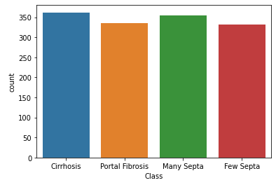

# Liver Disease Predictor

## Introduction

Liver cirrhosis affects nearly 80 million to 100 million Americans but remains widely misdiagnosed. There are many contributing factors to why, one of the main factors being that it can occur in even the healthiest of individuals. With symptoms that are similar to other illnesses it becomes that much difficult to properly diagnose. The medical community has started making progress in terms of diagnoses but the issue of misdiagnosis still remains. With the disease being so widespread, the number of healthy livers decreases which affects organ donation as well. Our team decided to tackle that problem by creating a tool for doctors to possibly catch liver cirrhosis early on before sending patients through extensive tests and treatments.

## About Data:

The dataset contains the different patients records with 4 types of liver disease. The dataset was used to build a Deep Learning model. After identifying key attributes from a patient test results the model should be able to predict which type of liver disease the patient has.

## Problem Statement:
Build a deep learning model to predict the type of a liver disease based on the patient’s attributes like Age, BMI, WBC, RBC etc.

## Train Deep Learning Model:
Train deep learning models based on different nodes configuration using library Keras Tensforflow. Model building would have following:
Exploratory Data Analysis using visualizations in pandas, matplotlb and seaborn

## Cleaning the data
Preprocessing of data using scikit learn library
Creating dummy (one-hot encoding) variables
Scaling the continuous variables
Train the model using Training dataset
Evaluation of model (check accuracy & error) using Test dataset
Save the best fit model

## Deploy the trained model on Heroku:
Deploy the trained model using flask application in python which would have the following:
A front-end interface for the user to interact and provide the input to required attributes
Execute the model in backend and the output of predicted liver disease type
